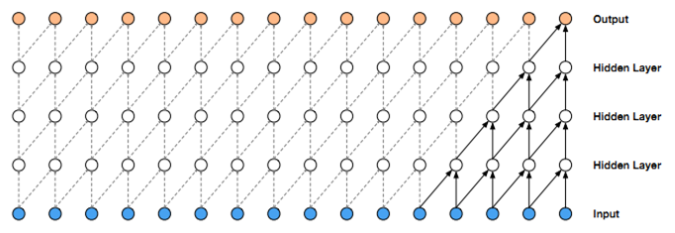
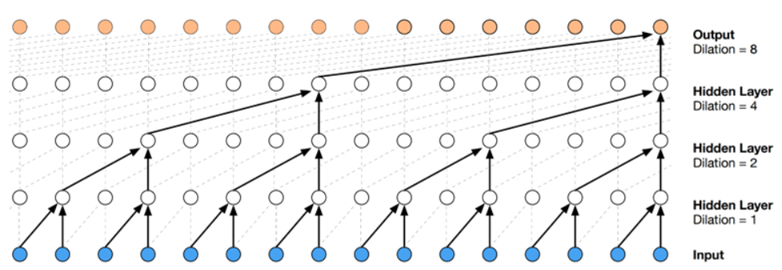
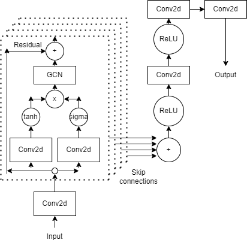
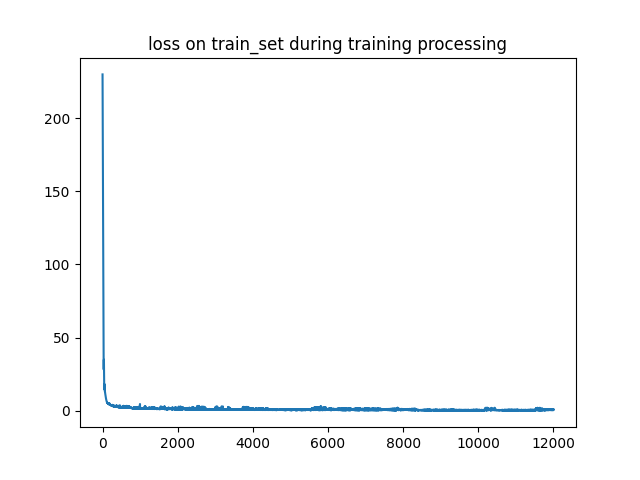
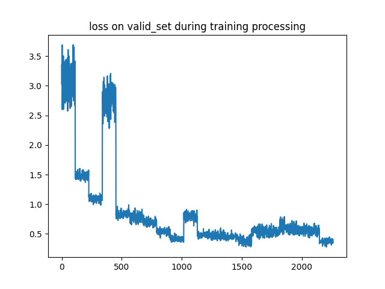
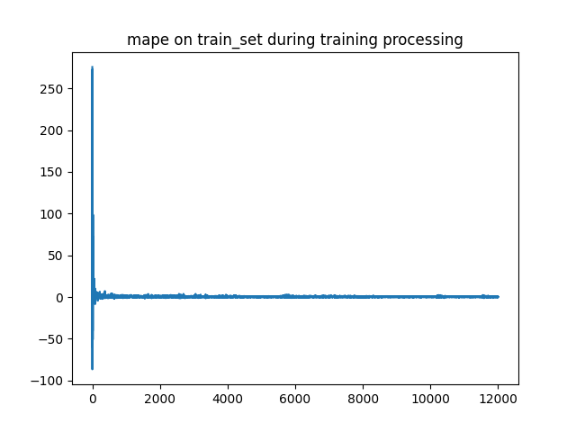
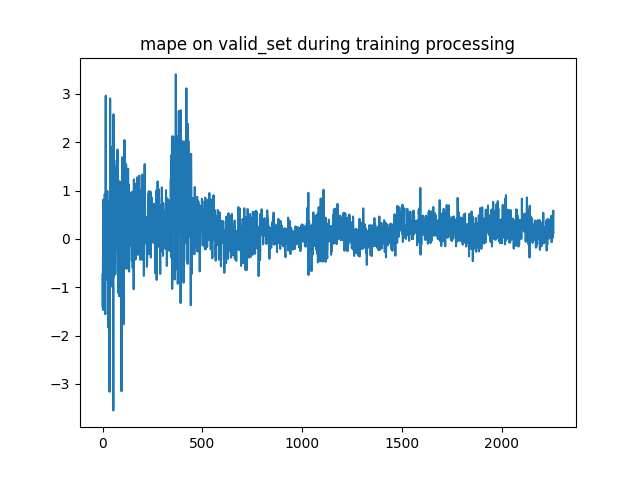
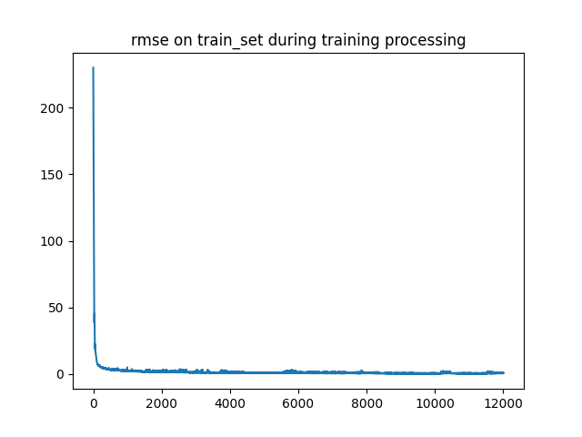
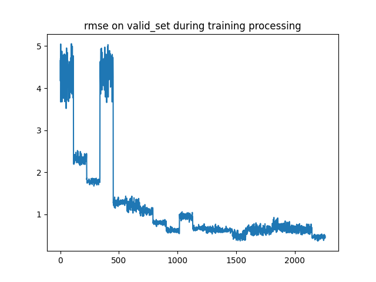

# WaveNet-Graph

&emsp;&emsp;在本次项目实验中参考论文[Graph WaveNet for Deep Spatial-Temporal Graph Modeling](https://arxiv.org/abs/1906.00121)和[示例代码]( https://github.com/nnzhan/Graph-WaveNet
)实现。

### 项目结构

```
└─lab5
    ├─data  // 存放数据集数据
    │
    ├─model // 模型组件
    |     causalconvd.py
    |     dilatedStack.py
    |     GCN.py
    |     residualLayer.py
    |     start_conv.py
    |     myModel.py
    |
    |-saveModel  //保存训练好的模型
    |
    |-config.py  // 该项目模型的一些参数设置
    |     
    |
    |-output     // 预测结果输出
    |
    |-tool //搭建模型用到的一些子定义工具类
    |     MydataLoader.py // 数据载入工具
    |     MyDataset.py    // 继承DataSet的自定义数据集
    |     standscaler.py  // 数据标准化工具
    |     Train.py        // 模型训练工具
    |
    |     
    |-DataLog  // 存放训练过程种产生的数据
    |
    |—figout  // 模型的训练结果展示图
    |      
    ├─main.py // 模型入口
    |
    |-aftertrain.py  // 用于完成训练之后对于损失值，验证集准确率等数据进行统计和可视化展示
    |
    |—requirement.txt // 该项目需要的一些外部包
```

### How to Run

#### install requirements

```shell
pip install -r requirements.txt
```

#### 可输入参数

```shell
--mode        # 运行模式（train（训练）/test（预测））
--in_dim      # 输入数据特征维度（默认1）
--num_sensor  # 传感器数量（默认170）

--epoch       # 训练迭代次数
--device      # 训练使用cuda/cpu(默认cuda)
--dropout
--lr          # learning rate
--wd          # weight decay

--save        # 训练模型保存路径
--trained_mode # 已有已经训练好的模型 
```

#### 训练模型

```shell
python main.py --mode train --epoch 20 --lr 0.0001 --save ./save_model
```

#### 预测结果（结果会保存到output文件夹）
```shell
python main.py --mode test --trained_model ./save_model/epoch_19.pth
```

### 项目介绍

### 1. 数据预处理

### 1.1 训练数据步长划分

&emsp;&emsp;对于本次项目实验所给数据，数据规模。数据形状为[14284,170, 1]，其中 14284 表示总的时间步，对应的总时间为 14284*5 分钟。170 代表传感器/时间序列的个数。所给数据利用滑动窗口对对数据进行划分每12个时间序列（1小时）进行划分。滑动窗口步长为2，经过划分得到训练数据，训练数据包括x（前12时间序列一小时的数据）和y（后12时间序列一小时的数据），x,y的规模都为[7130, 12, 170, 1]

- 7130为训练数据的数据条数
- 12为时间序列步长（1小时）
- 170为传感器数量
- 1为数据维度

### 1.2 验证集数据划分

&emsp;&emsp;在训练数据（条数7130）上利用RandomSampler随机划分6000条数据作为训练集，130条数据作为验证集（超参调整）。

### 1.3 数据标准化

&emsp;&emsp;对于读取到的数据，在训练之前需要利用numpy工具在前3维度（数据条数，时间序列长度，传感器数量）上进行标准化，同样地，利用模型训练得到的预测结果利用训练数据集的标准值进行反标准化得到真实的数据分布


### 2 模型搭建

### 2.1 时间维度

&emsp;&emsp;在模型的时间维度上利用TCN模块进行模型的搭建

&emsp;&emsp;对于输入的数据，包含[170(传感器数量为度) , 12(时间序列维度)]，传感器数量维度上无需考虑依赖，而在时间序列上将12个步长的时间序列进行卷积操作，因此在本人搭建的模型中将采用2D的卷积，kernel_size = (1,2),利用因果卷积，预测任务中，只是用历史信息进行预测，不包含未来的信息。

<div align = center>


</div>

&nbsp;
&nbsp;
&nbsp;
&nbsp;
<!-- 

 -->

&emsp;&emsp;同时为了提取很久以前的信息，在因果卷积的基础上增加了扩张卷积来增加卷积的感受野，同时保证不会产生梯度消失，训练复杂等问题。

### 2.2 TCN模型的修改优化

&emsp;&emsp;在[示例代码](https://github.com/nnzhan/Graph-WaveNet)中,在时间序列步数维度上采用多层layers和的扩大因果卷积来将训练数据的步长12卷积为1作为输出结果的特征维度，而将原本输入训练数据的特征维度通过卷积的的filter数量卷积为12作为预测时间序列步长12，也就是说在示例代码的模型中[示例代码](https://github.com/nnzhan/Graph-WaveNet)数据不同维度的值意义在输入是不同的，我认为这样的模型结构是不合理的，因此在本人的模型当中，我会在扩大因果卷积的TCN模型中加入padding，保证模型的前后数据输入在时间序列步长上的维度是相同的，同时，在模型数据先后的各个维度上的数据的意义也是相同的。保证模型利用前12步长时间序列（1小时）预测得到后12步长时间序列（1小时）的数据。

&emsp;&emsp;本次的实验中采取layers为4的扩大因果卷积来逐步扩大感受野，dilation的值取(1,2,4,8)

&emsp;&emsp;每次数据经过因果卷积，应为每层layers取值dilation不同，计算得到的数据的规模也不通过，为了使得数据每层layers前后数据规模保持一致（为了和下一个block连接），需要对数据进行padding，padding，对于padding的数值大小可以这样考虑

对于输入（batch, channels, num_sensor, seq_len）,经过因果卷积（kernel_size=(1,2),padding=(0,pad),dilation=dilation,stride=(1,1)）之后，大小变为（batch, channels, num_sensor,seq_out）,$$seqout = \frac{seqlen+2*pad-(kernelsize-1)*(d-1)+k}{1}$$所以，我们可以取pad为$\frac{d+1}{2}$


### 2.3 空间维度

&emsp;&emsp;对于空间数据，输入为[170(传感器数量) ,170(传感器数量)]的邻接矩阵数据，模型将利用自适应的学习方式得到新的邻接矩阵，将新的自适应邻接矩阵在传感器数量维度上于TCN模块的输出进行内积（将空位维度特征作为权重与时间维度特征内积）。

&emsp;&emsp;自适应邻接矩阵的生成方式如下式子所示：$$\hat{A_{adp}}=SoftMax(ReLU(E_1,E_2^T)),E_1,E_2=R^{N*c}$$

### 2.4 模型总结

<div align = center>

</div>

<!--  -->


&emsp;&emsp;首先input经过一层Conv2d把维度升高，然后将输入数据输入到TCN中，捕获时间依赖，然后传入GCN中提取节点之间的空间信息，然后与最初的输入进行残差连接，防止循环次数过程中信息的丢失。然后堆叠K层，通过不同大小的扩张因子，先后提取短期时间依赖和长期，逐步扩大感受野。在底层，也就是k比较小的时候，GCN获取到的是短期的时间依赖；K比较大时，接收到的时长期的时间依赖。经过多层的迭代，时空层就可以捕捉到长短期的时间依赖以及不同程度的空间依赖关系了。右侧的输出部分就是MLP的结构，将K个时空层的结果concatenate，然后通过三个Conv2d得到输出序列。

### 3. 模型训练

&emsp;&emsp;在实验过程中损失函数采用自定义的平均绝对值误差（MAE），优化器选则为Adam，模型在迭代epoch为50（可调参数），learning_rate=0.0001(可调参数),weight decay=0.0001(可调参数)，在每个epoch中每训练30个batch后便在验证集上进行一轮验证，验证指标包括平均绝对误差（MAE），均方根误差（RMSE），平均绝对百分比误差（MAPE）。训练过程中的指标变化如下：

<div align=center >


</div>

<div align=center >


</div>

<div align=center >


</div>
